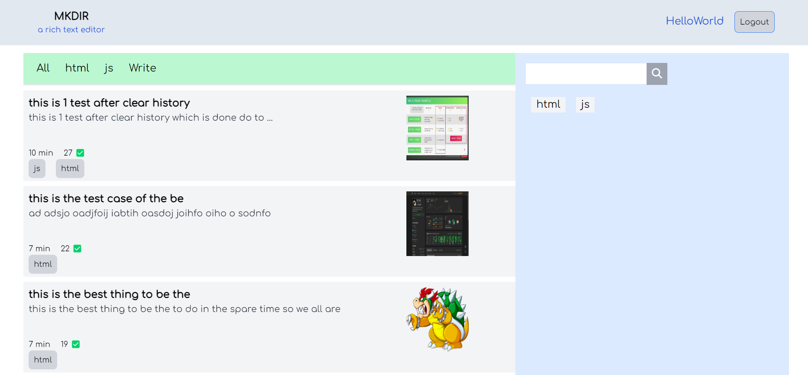

# Blog Post Application

This is a simple JS blog post application built with `React.js` for the frontend, `Quill.js` for the rich text editor, and `Node.js` with `MongoDB` for the backend.



## Features

- Create, read, update, and delete blog posts.
- Rich text editor powered by Quill.js for composing blog posts.
- User authentication and authorization.
- Having query option using tags provided by the user.

## Technologies Used

- **Frontend:**
  - React.js - JavaScript library for building user interfaces.
  - Quill.js - Rich text editor for composing blog posts.
  - React Router - Declarative routing for React applications.
  - Axios - Promise-based HTTP client for making API requests.
  - Tailwind CSS - CSS frameworks for styling UI components.

- **Backend:**
  - Node.js - JavaScript runtime environment for server-side development.
  - Express.js - Web application framework for Node.js.
  - MongoDB - NoSQL database for storing blog posts and user data.
  - Mongoose - MongoDB object modeling tool for Node.js.
  - JSON Web Tokens (JWT) - For user authentication and authorization.
  - bcrypt - For hashing passwords before storing them in the database.

## Setup Instructions

1. **Clone the repository:**

   ```bash
   git clone https://github.com/TheValour/JS-Blog.git
   ```

2. **Install dependencies:**

   ```bash
   cd backend
   npm install

   cd frontend
   npm install
   ```

3. **Configure environment variables:**


   Create a `.env` file in the `backend` directory and provide the following environment variables:

   ```plaintext
   PORT=3001
   MONGODB_URI="YOUR MONGO DB API KEY"
   JWT_SECRET=your-secret-key
   ```
   Create a `.env` file in the `frontend` directory and provide the following environment variables which are provided by the firebase server:

   ```plaintext
   VITE_API_KEY=''
   VITE_AUTH_DOMAIN=''
   VITE_PROJECT_ID=''
   VITE_STORAGE_BUCKET=''
   VITE_SENDER_ID=''
   VITE_APP_ID=''
   ```

   Update the values accordingly based on your `Firebase`, `MongoDB` setup and desired JWT secret.

4. **Start the server:**

   ```bash
   cd backend
   npm start
   ```

5. **Start the frontend:**

   ```bash
   cd frontend
   npm run dev
   ```

6. **Access the application:**

   Open your browser and navigate to `http://localhost:3000` to access the blog post application.

## API Endpoints

- `POST /api/signup` - Register a new user.
- `POST /api/login` - Login an existing user.
- `GET /api/list` - Get all blog posts.
- `GET /api/list/:tags` - Get the filtered blog posts using tags.
- `POST /api/write` - Create a new blog post.
- `GET /api/read/:id` - to the read the single blog post.
- `GET /api/tagList` - to the get all the tags present in the database

## License

This project is licensed under the [MIT License](LICENSE).
Contributions are welcomed and encouraged! Feel free to join us in enhancing this project together.

---

> made by TheValour
